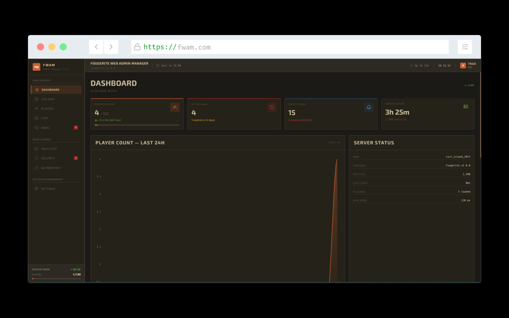
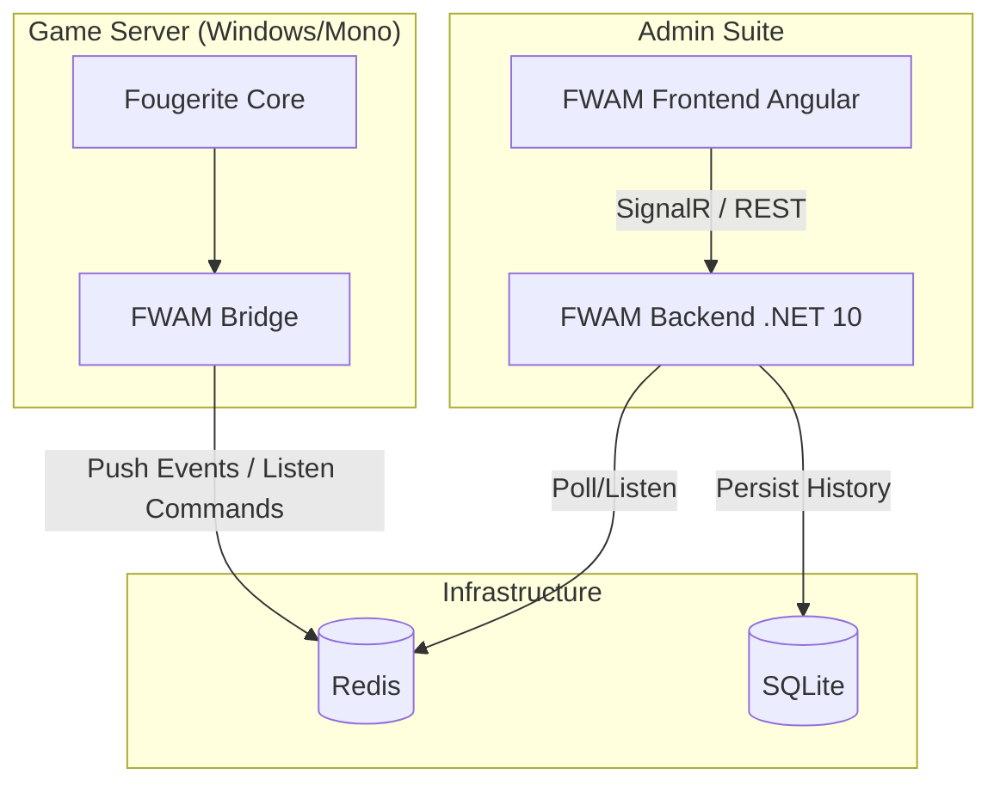

# Fougerite Web Admin Manager (FWAM)

A modern, real-time web administration suite and telemetry platform for **Rust Legacy** servers, powered by the [Fougerite](https://github.com/Fougerite/Fougerite) modding framework.




> [!CAUTION]
> **Project Status: Pre-Alpha / Work in Progress**
> This project is in very early development. 
> - Not all administration modules are fully implemented.
> - Some UI components still use **mocked data** (`MockDataService`).
> - The architecture is subject to frequent breaking changes.
> - Use in production environments at your own risk.

## 🚀 Overview

FWAM bridges the gap between the aging Rust Legacy server engine and modern web technologies. It provides server owners with a powerful dashboard to monitor player activity, manage server state, and execute commands in real-time through a sleek, responsive interface.

## 🏗️ Architecture

The system follows a decoupled, event-driven architecture using **Redis** as the central message bus and state cache.



### Key Components

1.  **FWAM Bridge (`fwam/fwam-bridge`)**: 
    - A C# module loaded directly into the Rust server process.
    - Captures game events (connections, chat, combat) and pushes them to Redis.
    - Executes commands received from the web interface.
    - Built for compatibility with the .NET 3.5/Mono runtime used by Rust Legacy.

2.  **FWAM Backend (`fwam/fwam-backend`)**:
    - A high-performance .NET 10 Web API.
    - Processes incoming events from Redis and persists long-term data to SQLite.
    - Maintains a real-time state of the server (online players, telemetry).
    - Exposes a SignalR hub and REST API for the frontend.

3.  **FWAM Frontend (`fwam/fwam-frontend`)**:
    - A modern Angular 19+ SPA.
    - Features a "Rust Legacy" inspired aesthetic using PrimeNG (unstyled) and custom CSS.
    - Provides real-time maps, player management, and live console logging.

## 🛠️ Tech Stack

- **Backend**: C#, .NET 10, Entity Framework Core, SignalR.
- **Frontend**: Angular, TypeScript, Signals, PrimeNG, RxJS.
- **Message Bus**: Redis (RESP Protocol).
- **Database**: SQLite.
- **Legacy Framework**: Fougerite (C# / .NET Framework 3.5).

## 🚦 Getting Started

### Prerequisites

- [.NET 10 SDK](https://dotnet.microsoft.com/download/dotnet/10.0)
- [Node.js & npm](https://nodejs.org/) (for Angular)
- [Redis](https://redis.io/) (Running on localhost:6379 by default)
- SQLite (Embedded, no installation required)
- [MSBuild](https://visualstudio.microsoft.com/downloads/) (for legacy C# projects)

### Installation

1. **Clone the repository**:
   ```bash
   git clone https://github.com/GabrielTrigo/fougerite-web-admin-manager.git
   cd fougerite-web-admin-manager
   ```

2. **Setup Infrastructure & Backend**:
   You can easily spin up Redis and the Backend API using Docker or Podman. The configuration is located in the `infra/` folder.
   
   ```bash
   cd infra
   docker compose up -d --build
   # or if you use Podman:
   # podman compose up -d --build
   ```
   *Note: This will start both Redis (port 6379) and the .NET 10 API (port 5259) in the background.*

3. **Build the Bridge**:
   > [!IMPORTANT]
   > The **FWAM Bridge** requires references to Fougerite and Rust Legacy assemblies (managed DLLs). 
   > 1. Ensure you have the `Fougerite` project built or the DLLs available in `Fougerite/bin/`.
   > 2. The project specifically looks for: `Fougerite.dll`, `Assembly-CSharp.dll`, `UnityEngine.dll`, `uLink.dll`, and `Facepunch.*.dll` in the `Fougerite/bin/` folder.
   > 3. If these are missing, the build will fail. You may need to copy them from your patched Rust Legacy server's `RustDedicated_Data/Managed` folder.

   ```powershell
   msbuild fwam\fwam-bridge\FougeriteAdminBridge.Plugin.csproj /p:Configuration=Release
   ```

4. **Configure the Bridge**:
   Before running your Rust server, ensure the plugin points to the correct Redis instance. Edit the `fwam/fwam-bridge/config/FWAMBridge.ini` file and set your Redis `Host` and `Port`. 
   ```ini
   [Redis]
   Host=127.0.0.1
   Port=6379
   
   [Channels]
   EventsList=fwam:events
   CommandsChannel=fwam:commands
   ```
   *Note: This `.ini` file should be copied to your Rust server's module configuration folder alongside the `.dll`.*

5. **Run the Backend (Manual Option)**:
   If you did not use the Docker compose method in step 2, you can run the backend manually:
   ```powershell
   cd fwam\fwam-backend
   dotnet run
   ```

6. **Run the Frontend**:
   ```powershell
   cd fwam\fwam-frontend
   npm install
   npm run start
   ```

## 📜 Redis Contract

Communication between the bridge and the backend is handled via Redis:
- **Events**: Pushed to `fwam:events` as JSON payloads.
- **Commands**: Published to `fwam:commands` using the format `ACTION|TARGET|ARG`.
- **Telemetry**: Cached in Redis keys for fast access.

## 🔗 Useful Resources

- [Fougerite Official Resource](https://fougerite.com/resources/fougerite-official.77/) - How to install Fougerite.
- [C# Plugin Development Guide](https://fougerite.com/threads/c-plugin-development-guide.543/) - Detailed guide on building C# plugins for Fougerite.
- [Fougerite GitHub](https://github.com/Fougerite/Fougerite) - Core framework repository.